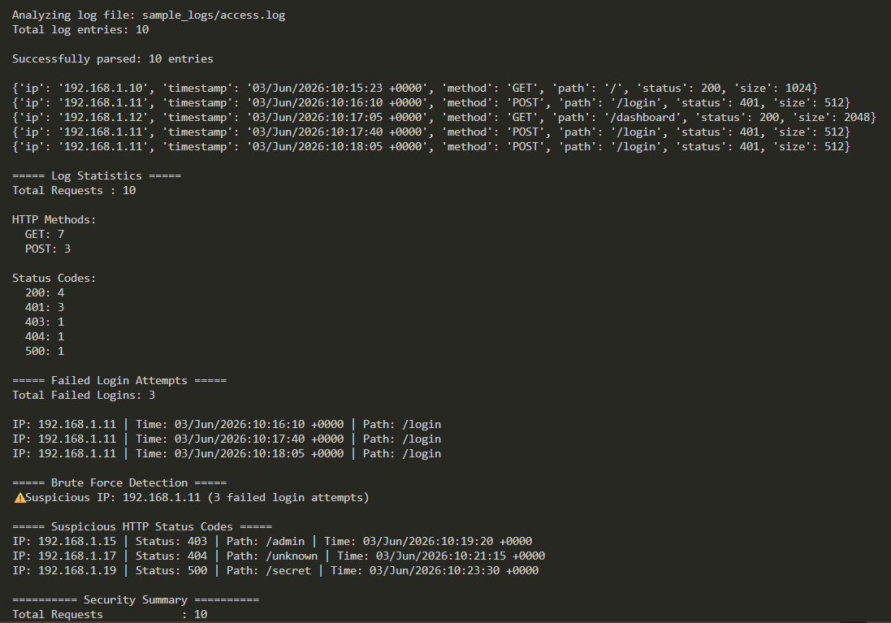
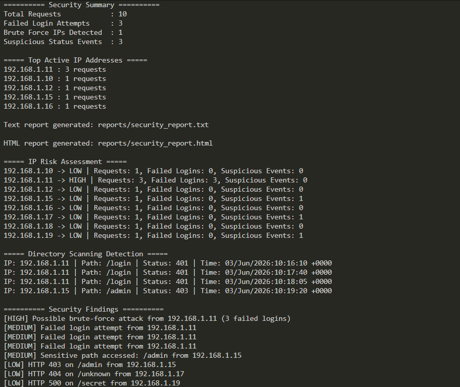
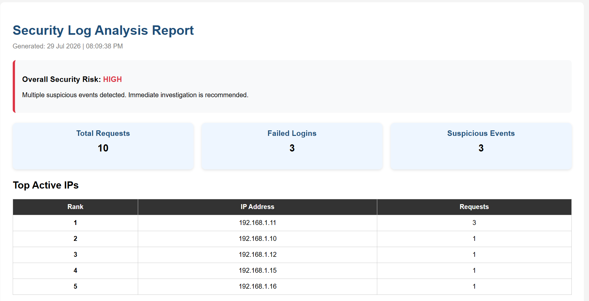
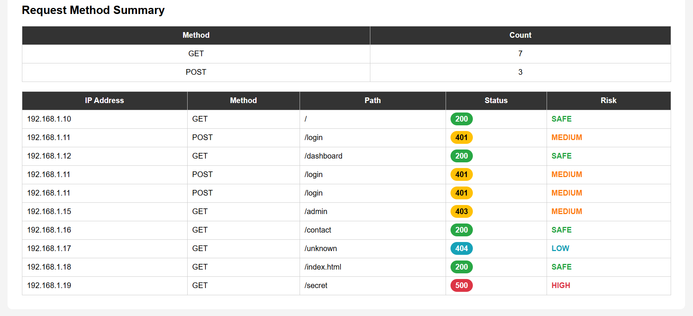

# 🔐 Security Log Analyzer

A Python-based Security Log Analyzer that parses web server access logs, detects suspicious activities, assesses security risks, and generates professional text and HTML reports.

This project demonstrates practical cybersecurity concepts including log analysis, brute-force detection, directory scanning detection, IP risk assessment, and security reporting.

---

## ✨ Features

- Parse Apache/Nginx access log files
- Display HTTP request statistics
- Detect failed login attempts
- Detect possible brute-force attacks
- Detect suspicious HTTP status codes (403, 404, 500)
- Detect directory scanning attempts
- Assess IP-based security risk
- Generate prioritized security findings
- Display top active IP addresses
- Generate professional text reports
- Generate interactive HTML dashboard reports

---

## 📂 Project Structure

```
security-log-analyzer/
│── analyzer.py
│── README.md
│── requirements.txt
│
├── sample_logs/
│   └── access.log
│
├── reports/
│   ├── security_report.txt
│   └── security_report.html
```

---

## ⚙️ Installation

### 1. Clone the repository

```bash
git clone https://github.com/Vikas-C-Gowda/security-log-analyzer.git
cd security-log-analyzer
```

### 2. Requirements

- Python 3.8 or later
- No external Python packages are required.

---

## 🛠️ Technologies Used

- Python 3
- Regular Expressions (`re`)
- Collections (`Counter`)
- HTML & CSS
- File Handling
- Command Line Interface (CLI)

---

## 📸 Screenshots

### Terminal Output (Part 1)



### Terminal Output (Part 2)



### HTML Dashboard (Overview)



### HTML Dashboard (Detailed Logs)



---

## 🚀 Future Improvements

- Export reports in JSON format
- Support additional log formats
- Real-time log monitoring
- Email alert notifications
- Interactive dashboard with charts

---

## 👨‍💻 Author

**Vikas C Gowda**

Computer Science Engineering Student | Cybersecurity Enthusiast

GitHub: https://github.com/Vikas-C-Gowda